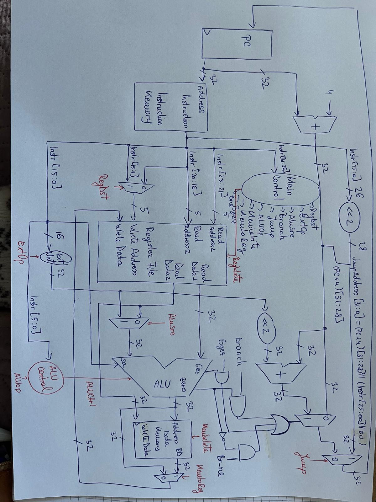
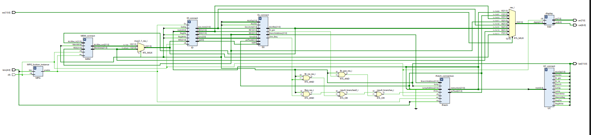
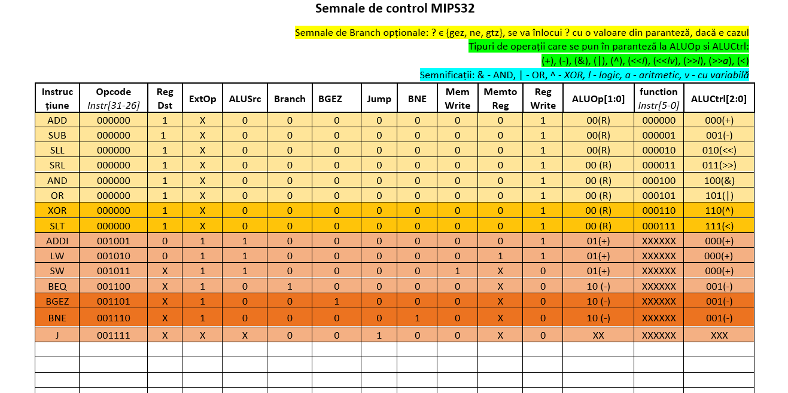
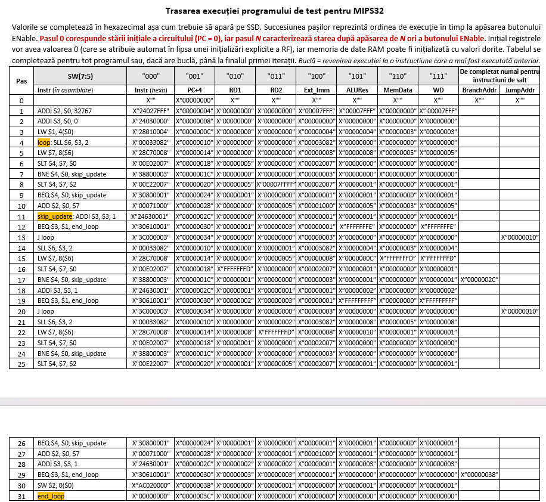

# MIPS32 Single-Cycle Processor Implementation


<p align="center">
  
</p>

## Description

This project implements a **32-bit MIPS single-cycle processor** designed using **VHDL** and tested on an FPGA board.

In the **single-cycle architecture**, each instruction is executed in a single clock cycle. All stages of instruction execution - fetch, decode, execute, memory access, and write-back - occur within the same cycle.

The design includes the implementation of the datapath, control unit, ALU operations, and branch logic required to support multiple instruction types.

The project demonstrates fundamental computer architecture concepts such as processor datapath design, instruction decoding, control signal generation, and execution of MIPS instructions on hardware.


## Processor Architecture

The processor executes each instruction in **one clock cycle**, meaning that all required operations occur sequentially within the same datapath during the cycle.

The main functional units of the processor include:

- Program Counter (PC)
- Instruction Memory
- Register File
- ALU
- Data Memory
- Control Unit
- Multiplexers for datapath control

Unlike pipelined architectures, the single-cycle processor does not require pipeline registers, and instruction execution is completed before the next instruction begins.


## Processor Datapath

<p align="center">
  
</p>

The datapath connects all functional units required for instruction execution.

The RTL schematic illustrates the hardware implementation of the processor, including the datapath connections and control signals that coordinate instruction execution.

The main datapath components are:

- Program Counter (PC)
- Instruction Memory
- Register File
- ALU
- Data Memory
- Control Unit
- Multiplexers controlling operand selection

The processor updates the Program Counter after each instruction, either with `PC + 4` or with a branch or jump target address.


## Implemented Instructions

The processor supports several instruction types.

### R-type
- ADD
- SUB
- AND
- OR
- XOR
- SLT

### I-type
- ADDI
- LW
- SW
- BEQ
- BNE
- BGEZ

### J-type
- JUMP

Some instructions required additional control logic.

For example:

- **XOR** performs a logical exclusive OR between two registers and stores the result in the destination register.
- **SLT** sets the destination register to `1` if `$s < $t`, otherwise `0`.
- **BGEZ** performs a conditional branch if the value of a register is greater than or equal to zero.
- **BNE** performs a branch if two registers contain different values.


## Control Signals

The processor control unit generates the necessary control signals for each instruction type.

The table below shows the configuration of the control signals used to control datapath operations for different instructions.

<p align="center">
  
</p>


## Branch Logic

Branch instructions modify the Program Counter based on the evaluation of a condition.

Additional control signals are used to determine the correct branch behavior:

- `Branch`
- `Br_ne`
- `Br_gez`

These signals are generated by the **Main Control Unit** and used together with ALU comparison results to determine the next PC value.

Branch target addresses are calculated using:

```
BranchAddress = (PC + 4) + (SignExtend(offset) << 2)
```

This allows conditional jumps to different parts of the program.


## Technologies
- VHDL
- FPGA
- Digital Logic Design
- MIPS32 Architecture

Tools used:
- Vivado / Xilinx tools
- FPGA development board


## Project Structure
```
MIPS32-SingleCycle/
│
├── IFetch.vhd        # Instruction Fetch module
├── ID.vhd            # Instruction Decode module
├── EX.vhd            # ALU execution module
├── MEM.vhd           # Data memory module
├── UC.vhd            # Control Unit
│
├── SSD.vhd           # Seven segment display module
├── mpg.vhd           # Button control module
│
├── test_env.vhd      # Top level test environment
│
└── test_env.bit      # FPGA bitstream
```

## Features
- 32-bit MIPS processor implementation
- Single-cycle execution model
- Full datapath implementation
- Control unit generating instruction control signals
- Support for arithmetic, logical, memory and branch instructions
- FPGA implementation and testing
- Seven-segment display debugging


## Testing
The processor was tested using an **assembly test program** executed on the FPGA board.

The program verifies correct instruction execution and proper control signal behavior for different instruction types such as arithmetic, memory access, and branch operations.

Intermediate values such as registers, ALU results, and memory outputs can be observed through the **seven-segment display module**, allowing step-by-step verification of processor behavior.

The execution trace of the test program was analyzed to ensure that the values displayed on the FPGA correspond to the expected results for each instruction step.


### Execution Trace

The execution of the assembly test program was analyzed step by step to verify the correct behavior of the processor.

Each step corresponds to a clock cycle triggered by pressing the **Enable** button on the FPGA board. The values displayed on the seven-segment display correspond to internal datapath signals such as registers, ALU results, memory data, and branch addresses.

<p align="center">
  
</p>

This trace allows verification that the values generated by the processor match the expected results for each instruction during execution.

## Author
Francesca Lara Szarka  
Computer Science Student  
Technical University of Cluj-Napoca